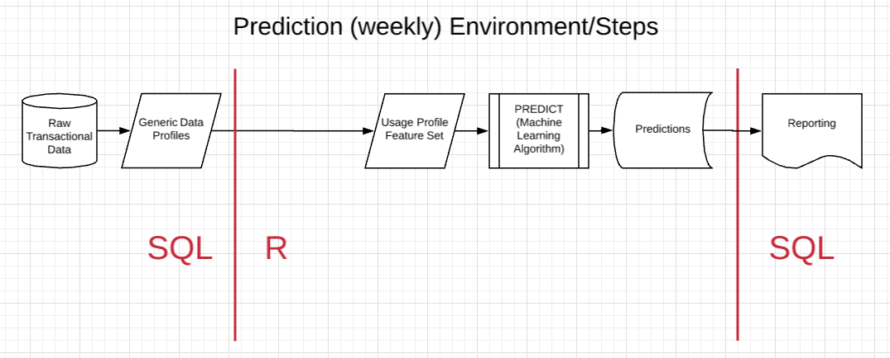

```{r setup, include=FALSE}
knitr::opts_chunk$set(echo = TRUE)
```

### Project Description

The generic framework generated to train a machine learning model producing predictions for subsequent reporting is presented here. The operational prediction code begins, ends, and will run in SQL on HSPSDATA, an SQL Server. However, most of the internals were build in R and nearly all of the model training environment is developed in R. 

The code and method were initially generated, and will be shared here, using eClaim submissions as the example dataset and problem set. Truth was generated using k-means clustering results of the normalized (shape) weekly eClaim profiles. The daily eClaim profiles were trimmed using our own cut-point algorithm and then fed to a feature/cognostic set generator, again developed by our team. Those features become the predictors in the machine learning algorithm. The predictions from the model will help identify which customer accounts are at risk of stopping their use of the product (in this case eClaims). Generating a standardized framework and generic individual components allows for a nearly plug-and-play analysis experience and unparalleled efficiencies.


## Model Training Environment/Steps

### Raw Transactional Data

Jeremie created and runs a script against the production archive to generate a table called *dbo.Claim* on both the DTXHIPAA and EZDHIPAA databases on HSPSDATA. The following view, temporary called *dbo.vweClaimRawData*, in the SupportReports database on HSPSDATA joins a few fields from the *dbo.Claim* table to ultimately tie each ClaimID to an AccountNumber (from Siebel). 

Chad Crawford helped identify an improvement in query speed by moving the DISTINCT selection (necessary because *Siebel.dbo.Assets* duplicates data) inside and apply it to only the data joined from *dbo.Practice*, *dbo.Assets*, *dbo.Accounts*, thus avoiding applying it to the larger *dbo.Claim* or joined *dbo.File_Record* tables.


```{sql sqleClaimJoins, echo = T, eval = F}
USE [SupportReports]
GO

/****** Object:  View [dbo].[vwTrentonV2]    Script Date: 1/30/2018 12:34:38 PM ******/
SET ANSI_NULLS ON
GO

SET QUOTED_IDENTIFIER ON
GO


ALTER VIEW [dbo].[vwTrentonV2]

AS

SELECT Claim_Id      
       , Claim.Create_Date
       , Payer_Id 
       --,Payer_Destination_Id
       , Claim_State
       , Trim.AccountRowId
       , Trim.AccountNum AS AccountNumber
--Select top 100 *
FROM DTXHIPAA.dbo.Claim AS Claim
LEFT JOIN DTXHIPAA.dbo.File_Record AS Fil
       ON Claim.File_Record_ID = Fil.File_Record_ID
LEFT JOIN 
(
       SELECT DISTINCT AccountNum 
              , Acct.AccountRowId
              , Asst.eSrvAdminUser
              , Practice_ID
       FROM DTXHIPAA.dbo.Practice AS Pract
       LEFT JOIN Siebel.dbo.Assets AS Asst
              ON Pract.User_ID_Nbr = eSrvAdminUser
       LEFT JOIN Siebel.dbo.Accounts AS Acct
       ON Asst.AccountRowId = Acct.AccountRowId
              AND Acct.Active = 1
       WHERE Asst.Active = 1
) AS Trim
       ON  Fil.Practice_ID = Trim.Practice_ID


UNION ALL

SELECT Claim_Id      
       ,Claim.Create_Date
       ,Payer_Id 
       --,Payer_Destination_Id
       ,Claim_State
       ,Trim.AccountRowId
       ,Trim.AccountNum AS AccountNumber
FROM EZDHIPAA.dbo.Claim AS Claim
LEFT JOIN EZDHIPAA.dbo.File_Record AS Fil
       ON Claim.File_Record_ID = Fil.File_Record_ID
LEFT JOIN 
(
       SELECT DISTINCT AccountNum 
              , Acct.AccountRowId
              , Asst.eSrvAdminUser
              , Practice_ID
       FROM EZDHIPAA.dbo.Practice AS Pract
       LEFT JOIN Siebel.dbo.Assets AS Asst
              ON Pract.User_ID_Nbr = eSrvAdminUser
       LEFT JOIN Siebel.dbo.Accounts AS Acct
       ON Asst.AccountRowId = Acct.AccountRowId
              AND Acct.Active = 1
       WHERE Asst.Active = 1
) AS Trim
       ON  Fil.Practice_ID = Trim.Practice_ID
GO
```


### Generic Data Profiles

In this case we generate daily profiles of the number of claims submitted by each AccountNumber. This process is summarized in four steps.

1. Generate a daily sequence from Jan 1, 2000 to today.    
2. Create a table of Count = 0 for each day from the start of the data to today.    
3. Summarize the counts (of eClaims submitted) to daily dates by ID (AccountNumber).    
4. Join the summarized counts to include zeros on dates where no eClaims were submitted.    

This approach is agnostic to both summary level (here it's days) and ID (here it's AccountNumber). Below are the two SQL files that generate the daily data profiles by AccountNumber.


```{sql sqlCalendarDays, echo = T, eval = F}

/****** Script to generate daily dates from 01/01/2000 -- GETDATE() ******/

CREATE TABLE [SupportReports].[dbo].[calendarDays]([CalendarDate] DATE);
DECLARE @StartDate DATE;
DECLARE @EndDate DATE;
SET @StartDate = '20000101';
SET @EndDate = GETDATE();
WHILE @StartDate <= @EndDate
    BEGIN
        INSERT INTO [SupportReports].[dbo].[calendarDays]([CalendarDate])
               SELECT @StartDate;
        SET @StartDate = DATEADD(dd, 1, @StartDate);
    END;
```


```{sql sqlGenerateDailyProfiles, echo = T, eval = F}
/****** Generate daily profiles by AccountNumber  ******/
/** https://stackoverflow.com/questions/19075098/how-to-fill-missing-dates-by-groups-in-a-table-in-sql **/
/**	https://stackoverflow.com/questions/7824831/generate-dates-between-date-ranges **/

/****** Three scripts to create full/expanded daily profiles of eClaim data ******/

/****** Script to generate daily zeros from [SupportReports].[dbo].[calendarDate] ******/
DECLARE @startDate DATE= '20141001', @endDate DATE= GETDATE();
SELECT DATEADD(DAY, nbr - 1, @startDate) AS ymd,
       0 AS Count
INTO [SupportReports].[dbo].[dailyZero]
FROM
(
    SELECT ROW_NUMBER() OVER(ORDER BY c.CalendarDate) AS Nbr
    FROM [SupportReports].[dbo].[calendarDays] c
) AS nbrs
WHERE nbr - 1 <= DATEDIFF(DAY, @startDate, @endDate);


/****** Script to generate SupportReports.dbo.eClaimDailyProfiles (3 min) ******/
SELECT AccountNumber,
       CONVERT(DATE, [Create_Date]) AS ymd,
       COUNT(*) AS Count
INTO [SupportReports].[dbo].[eClaimDailyProfiles]
FROM [SupportReports].[dbo].[vweClaimRawData]
WHERE Claim_State IN('ACCEPTED', 'SETTLED', 'SETTLED ')
GROUP BY AccountNumber,
         CONVERT(DATE, [Create_Date]);


/****** Script to generate SupportReports.dbo.eClaimDailyProfilesExpanded (1 min) ******/
DECLARE @startDate DATE= '20141001', @endDate DATE= GETDATE();
SELECT dailyZeroAccount.AccountNumber,
       dailyZeroAccount.ymd,
       COALESCE(eClaimDailyProfiles.Count, 0) AS Count
INTO [SupportReports].[dbo].[eClaimDailyProfilesExpanded]
FROM
(
    SELECT AccountNumber,
           ymd
    FROM
	(
		SELECT AccountNumber,
			@startDate AS minYMD,
			@endDate AS maxYMD
		FROM [SupportReports].[dbo].[eClaimDailyProfiles]
		GROUP BY AccountNumber
	) AS tmp
	CROSS JOIN [SupportReports].[dbo].[dailyZero] AS dailyZero
		WHERE dailyZero.ymd BETWEEN tmp.minYMD AND tmp.maxYMD
) AS dailyZeroAccount
LEFT JOIN [SupportReports].[dbo].[eClaimDailyProfiles] AS eClaimDailyProfiles ON dailyZeroAccount.AccountNumber = eClaimDailyProfiles.AccountNumber 
	AND dailyZeroAccount.ymd = eClaimDailyProfiles.ymd
	ORDER BY dailyZeroAccount.AccountNumber,
		dailyZeroAccount.ymd; 

```


Read the SQL table into R to:     
1. generate a *real* profile,     
2. remove accounts that weren't customers for a sufficient time,    
3. determine **Truth** (Healthy or Dropped) using k-means clustering,    
4. create cognostics/feature set for modeling,    
5. model using machine learning algorithms,    
6. validate model and show prediction accuracy metrics,    
6. store information/model for prediction in operational weekly setting.    


```{r readInData, eval = F}
library(tsCogs)
library(RODBC)

tic()
###  Read in Daily Profiles of eClaims submissions created in SQL table  ###
sqlFilename <- 'dbo.eClaimDailyProfilesExpanded' # 4.2 mins, ~625 Mb, ~40.8 M rows for new data
cn <- odbcDriverConnect("Driver={SQL Server Native Client 11.0};Server=hspsdata.nt.local;Database=SupportReports;Uid=USHSI/trenton.pulsipher;Pwd=22AngelA;trusted_connection=yes;",
                       believeNRows = F)
d <- sqlFetch(cn, sqlFilename) 
toc()

saveRDS(d, file = "~/R/R_prjs/tsCogs/R_Data/rawDailyProfilesAll.rds")
# load("~/R/R_prjs/tsCogs/R_Data/rawDailyProfilesAll.rds")
```


### Cut-Point Algorithm

```{r cutpt, eval = F}
# make minor initial adjustments
tic()
rawData <- d %>%
  mutate(AccountNumber = as.character(AccountNumber)) %>%
  as.tibble() %>%
  rename(Date = ymd) %>%
  group_by(AccountNumber) %>%
  filter(!is.na(AccountNumber),
         Date >= ymd("2014-11-01"),
         Date <= ymd("2018-02-24")) %>%
  arrange(Date)
toc()

# run cutPoint algorithm (5 mins)
tic()
cutData <- rawData %>% 
  cut_point()
toc()


# apply rules: >600 claims total and >90 days of claims (14 sec) (removed roughly 5,500 accounts)
tic()
cutData %<>%
  group_by(AccountNumber) %>%
  mutate(totalCount = sum(Count),
         numDays = n()) %>%
  filter(totalCount >= 600,
         numDays >= 90)
toc()

# grab only AccountNumber after applying the rules
keepIDs <- cutData %>%
  pull(AccountNumber)
```


### k-means Clustering to determine Truth

K-means clustering is an unsupervised machine learning method that requires no response variable (truth) for model fitting. This allowed us to generate the truth as a function of the clustering output. A good visual animated example of kmeans clustering is given [here](http://shabal.in/visuals/kmeans/1.html). We examined several different functions/algorithms implementing kmeans clustering, including:

1. cluster::kmeans()    
    - base R function    

2. cluster::clara()    
    - base R function built for bigger data    

3. biganalytics::bigkmeans()    
    - revolutionAnalytics/Microsoft R function for bigger data     

4. sparklyr::ml_kmeans()    
    - distributed/big data version using Apache Spark     

5. dtwclust::tsclust()  
    - time series clustering    
    - preferable but not scaled for our needs

The sparklyr version ran in six minutes (compared to two hours for the base R version), which made that function the best solution of the five options. In theory natural preference would be to use a time-series clustering approach like dtwClust::tsclust(), however, that function doesn't scale well.  

```{r clusterAnalysis, eval = F}

```

[INSERT cluster results]

### Usage Profile Feature Set


### MODEL (Machine Learning Algorithm)


### Predictions


## Model Prediction Environment/Steps

The one-time run of the model training framework produces the prediction model. Some of the same steps developed for the training framework will be used in the prediction framework to operationalize the methods. The figure below shows those steps which are run weekly and contain identical code (except the PREDICT step) and output. Another documentation file will contain the details for running the weekly prediction steps on the SQL Server (R code run as a stored procedure).



